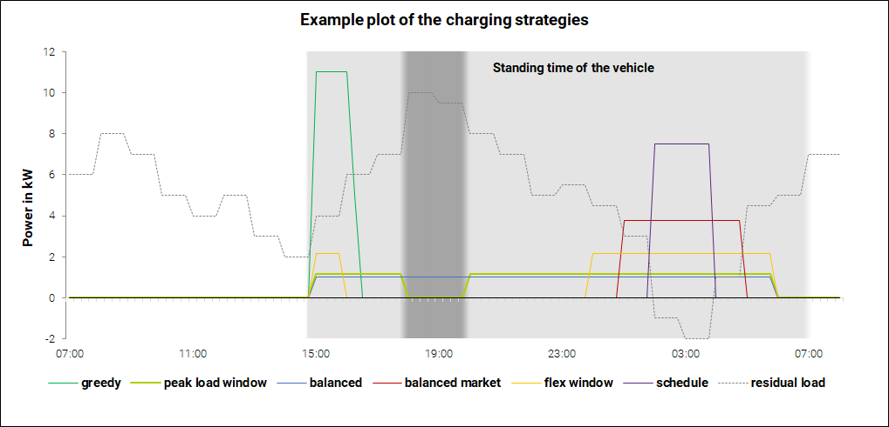

.. _charging_strategies:

~~~~~~~~~~~~~~~~~~~~~~~~~~~~~~~~~~~~~~~~
Charging strategies and cost calculation
~~~~~~~~~~~~~~~~~~~~~~~~~~~~~~~~~~~~~~~~

Charging strategies
===================

The core of SpiceEV are the different charging strategies. They decide how to react to events, when to charge the
vehicles and by how much. To see how to set strategy options, refer to
:ref:`Command line options <command_line_options>`. The following table indicates whether a charging strategy considers
stationary batteries, V2G or local generation.

+--------------------------+-----------------------------+-------------------------------+-------------------------------+
|**Charging strategy**     | **Stationary batteries**    | **V2G**                       |  **Local generation**         |
+--------------------------+-----------------------------+-------------------------------+-------------------------------+
| Greedy                   | x                           | x                             |  x                            |
+--------------------------+-----------------------------+-------------------------------+-------------------------------+
| Balanced                 | x                           | x                             |  x                            |
+--------------------------+-----------------------------+-------------------------------+-------------------------------+
| Balanced market          | x                           | x                             |  x                            |
+--------------------------+-----------------------------+-------------------------------+-------------------------------+
| Schedule                 | x                           | x                             |  x                            |
+--------------------------+-----------------------------+-------------------------------+-------------------------------+
| Peak shaving             | x                           |                               |  x                            |
+--------------------------+-----------------------------+-------------------------------+-------------------------------+
| Peak load window         | x                           |                               |  x                            |
+--------------------------+-----------------------------+-------------------------------+-------------------------------+
| Flex window              | x                           | x                             |  x                            |
+--------------------------+-----------------------------+-------------------------------+-------------------------------+
| Distributed              | x                           | x                             |  x                            |
+--------------------------+-----------------------------+-------------------------------+-------------------------------+

Greedy
------
As soon as a vehicle is connected, it is charged at the maximum possible power until the desired state of charge (SOC) is reached.
Depending on the grid connector (GC), the power must be throttled in order to not exceed its maximum power. A vehicle
may be charged above the desired SOC if there is energy surplus from local generation or the energy price falls below the set price threshold.

Balanced
--------
Each vehicle is charged with the minimal possible power over its standing time to reach the desired SOC. A vehicle
may be charged above the desired SOC if there is energy surplus from local generation or the energy price falls below the set price threshold.
A prerequisite for this strategy is an estimate of the standing time. In the simulation model, a perfect foresight is used for
this purpose. By defining a time horizon, it is possible to specify how far in the future departure times are known.

Balanced market
---------------
Similar to the previous strategy, the charging of the vehicles depends on a given external price time series. A vehicle
is charged such that is uses the entire duration of all periods with the lowest price to reach the desired SOC, whereby
the minimum possible charging power of each vehicle type is also taken into account. In case that time is not sufficient
the periods of the next higher price are used for charging, too.

Schedule
--------
The distribution network operator sends an individual "charging schedule" to the connection users which contains the
time and amount of the total power to be called up for the grid connection. The charging schedule is based on the
flexibility potential of the connection users (total demand for electrical energy, maximum total power of the location
and the core standing time of the vehicle fleet (only for "collective") as well as the expected grid situation.
The core standing time is a fixed period of time during which all vehicles are guaranteed to be available.
Two different sub-strategies can be used:

- Collective: All vehicles are controlled as a unit.
- Individual: All vehicles are controlled individually.

Peak shaving
----------------
Peak shaving aims to flatten power peaks by drawing power in times of low load and supporting grid connectors (e.g. with a stationary battery) in times of high load.
Vehicles charge in order of standing time (short standing events get priority) and try to avoid charging in times of high load.
In case the highest current load must be exceeded, the needed energy is balanced such that a flat load curve is achieved over the standing time.
Stationary batteries will charge in times of low load and discharge in times of high load. This is achieved using a rolling horizon and simulating the battery use during the horizon in each timestep within the simulation.
The desired result is a flat load curve without peaks. Works best with `perfect_foresight` (enabled by default) and a sufficient `HORIZON` (24 h by default).

Peak load window
----------------
Given time windows of high load, this strategy tries to charge outside of these windows. The example time windows are
given in the JSON `examples/data/time_windows.json`. In a first step the peak power inside these time windows is calculated.
Usually this peak power is set by a fixed load at the grid connector (e.g. a load from the building). If there are no
fixed loads, the peak power is set to zero.
The strategy tries to draw power outside the windows, using a balanced approach.
Inside time windows, consumers like electric vehicles or stationary batteries can draw power up to the peak power.
If this energy is not sufficient, a peak shaving algorithm tries to keep the peak power as low as possible.

Flex Window
-----------
This strategy uses time windows during which charging is encouraged and those where it is discouraged. The time windows
are determined by the grid operator (similar to `schedule` strategy). During time windows where charging is encouraged
the vehicles are charged with one of the following sub-strategies:

- Greedy: The vehicles that are below their desired SOC are charged one after the other, the rest is ordered by time of
  departure. Vehicles with earlier departures are charged first.
- Needy: The vehicles with little energy missing to reach their desired SOC are charged first. The vehicles are charged
  one after the other.
- Balanced: Every vehicle is charged in such a way that it uses the entire cross section of its standing time and
  charging windows.

If not all vehicles can be charged during the time windows where charging is encouraged, the rest of the energy is
charged in non-charging windows. The remaining energy consumption of the entire fleet is balanced out across all
non-charging windows to keep power peaks as low as possible.

Distributed
-----------
This strategy uses different charging strategies at different grid connectors. A differentiation is made between depot
and opportunity charging stations. Vehicles connected to opportunity charging stations are charged according to the
'greedy' strategy. Vehicles connected to depot charging stations are charged according to the 'balanced' strategy. At
sites with a limited number of charging stations the vehicles are prioritized as follows: All vehicles that want to
connect in the current and future time steps are collected and ranked by their SOC. The vehicle(s) with lowest SOC are
loaded first until their desired SOC is reached or the vehicle departs. As soon as the charging station is available
again, the process is repeated.

Cost calculation
================

The electricity costs for a location depend on the chosen charging strategy and the cost calculation scheme used.  Electricity costs consist of grid fees, power procurement, taxes and levies. In case of surplus power (by utilizing V2G or feed-in of a PV power plant), the feed-in remuneration is subtracted [#]_.

The schemes can be divided into three categories:
    • fixed costs: fixed_wo_plw, fixed_w_plw
    • variable costs: variable_wo_plw, variable_w_plw
    • special costs: balanced_market, flex_window

Fixed costs
-----------
This is the basic cost scheme reflecting the German regulation used by most consumers today, where specific costs do not change over (simulation) time. The fixed specific values for commodity charge (as part of the grid fees) and procurement are taken from the price sheet and the total costs are calculated using the total amount of electrical energy supplied from the grid. Additionally, standard load profile (SLP) customers pay a fixed basic charge per year. Consumption metering (Registrierende Leistungsmessung, RLM)  customers pay a capacity charge instead. If no peak load windows scheme (see below) is applied, the capacity charge is calculated using its specific value from the price sheet, which is multiplied with the maximum power supplied at the grid connector in the simulation time. Depending on the time of grid utilization, one out of two different RLM tariffs for commodity and capacity charge are used. For a grid utilization time >= 2500 h/a and therefore a low peak load compared to the amount of supplied energy per year, a lower commodity charge and a higher capacity charge is given.

Variable costs
--------------
This scheme is similar to the fixed costs scheme. However, the energy price (as part of the grid fees and/or the procurement price) can be dynamic. A price timeseries can be defined as a list for both procurement and commodity costs. If one of both lists is not defined, the fixed specific value for this cost component is taken from the price sheet (same as in fixed costs). At least one of the two lists must be supplied.

Peak load windows (PLW)
-----------------------
Both fixed and variable costs may take PLW into account (using the suffix "_w_plw" instead of "_wo_plw"). In that case, capacity costs (which are dependent on the maximum power drawn from the grid connector) take only power during PLW into account and the specific grid fees for grid utilization times >= 2500 h/a are applied.

Balanced market
---------------
The balanced_market pricing scheme reflects a planned change in German regulation. Similar to variable costs without PLW, the incentive is to draw power in times of low cost. Here, only the energy price as part of the grid fees can by dynamic, while the procurement price stays constant. The respective price timeseries usually contains three tariff levels, representing low, medium and high grid loads. The supplied energy is multiplied with the commodity charge during the time of supply. This way, an incentive is set for customers to charge their vehicles at times when the risk of an overload of the grid equipment is low.

In this incentive model, a high power demand may be encouraged to draw electricity at times of low grid usage. Since the customers should not be financially worse off for this desired behavior by having to pay high capacity related costs, only the peak demand in times of the highest tariff is relevant for the capacity charge for the flexible loads. Additionally, regardless of the actual utilization time of the power grid, the capacity charge for grid utilization times >= 2500 h/a is used.

Flexible time windows
---------------------
Based on the forecast grid situation, low tariff windows and high tariff windows are defined. If curtailment of renewable power plants is forecast or local generation outweighs load, these periods become low tariff windows.
When using flexible time windows, the flexible loads such as electric vehicles are charged with the tariff for grid friendly charging from the price sheet. Load peaks in low tariff time windows are not taken into account when determining the capacity related costs. The calculation of the capacity related costs is based exclusively on the power peaks in high-tariff windows. This way, charging during times of renewable power curtailment or high feed-in is encouraged.

Schedule-based grid fees
------------------------
Similar to the flexible time windows, the tariff for grid friendly charging is applied on the flexible loads such as electric vehicles when using schedule-based grid fees. However, a capacity charge is not applied on the flexible load. Instead, the deviation of the total load from the schedule is charged. Taking a deviation tolerance into account, a deviation charge is multiplied with the difference of the maximum positive deviation and the tolerated deviation if the selected tolerated deviation is exceeded. The capacity related costs are determined for grid supply. Deviations in feed-in are not taken into account.

.. rubric:: Footnotes

.. [#] In the current version of SpiceEV the feed-in remuneration is only determined for photovoltaic power plants with
       a nominal power <= 100 kW.
